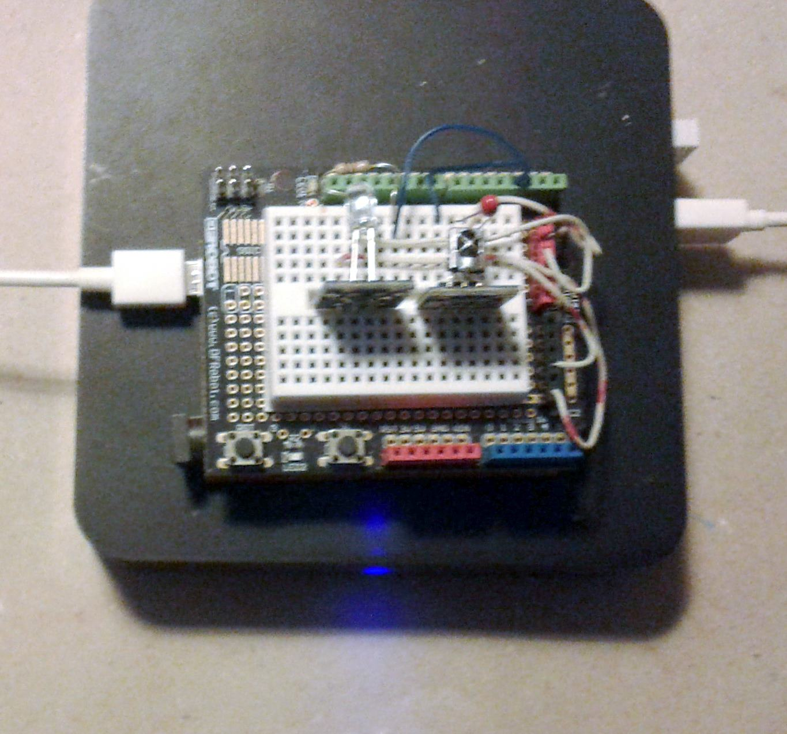
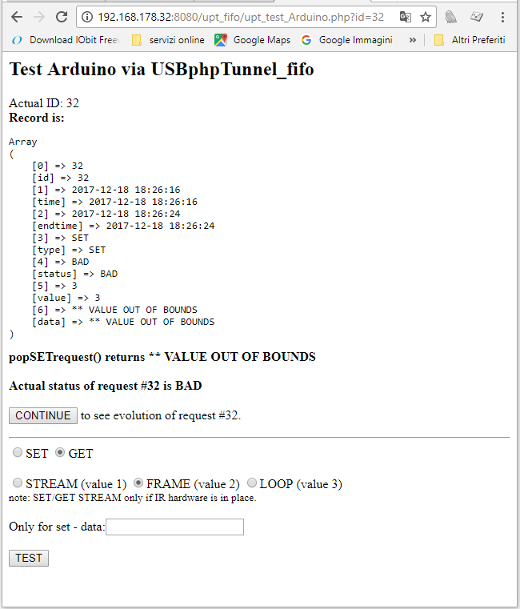

# USBphpTunnel_fifo

 This is an extension to USBphpTunnel (https://github.com/msillano/USBphpTunnel) with the goals:
  - make php master (in USBphpTunnel Arduino is master)
  - non blocking communications.
  - allow concurrence
    
 This extension is general pourpose, but the demo uses an Arduino sketch developped for remotesDB (https://github.com/msillano/remotesDB)
 
 
 
## How it works
 - step1: The php 'push' a request on the fifo.
 - step2: The Arduino tests in polling the fifo and gets the request.
 - step3: Arduino processes the request and update the fifo with the result.
 - step4: The php can now get the response.
 
## Demo 
 The file upt_test_arduino.php is a demo for this library:
 
 
 
## Implementation
 
 Protocol:
 
   upt_fifo uses an extensible generic protocol: SET or GET + COMMAND_ID + [data] = (S|G)(1|2|3)[<ascii data>]
   (e.g.: G2, S32000 etc.). Error messages from Arduino in data, starting by '*'. '\n' is terminator.
 
 Fifo:
 
 The fifo is implemented as a DB table: (see fifo_table.sql) having the fields:
  - `id`:  auto_increment request ID (for concurrence)
  - `time` creation timestamp 
  -  `endtime` end timestamp 
  -  `type` enum('SET','GET') NOT NULL,
  - `status` enum('WAIT','PROCESS','READY','DONE','BAD') the message evolution
  - `value` int(3) the command selector (in demo implementation is limited to 1..3)
  - `data` varchar(4000) data sended by php (SET) or data sended by Arduino (GET)
   The records in fifo are not deleted.
   
 Library  (upt_fifi.php)

 In this file all primitives for fifo management. The main php program uses: 
   - id = pushGETrequest() or id = pushSETrequest()
   - status = statusRequest(id)
   - data = popGETrequest(id) or data = popSETrequest(id)

The following pages makes an Automa triggered by Arduino:
  - upt_fifow.php : for arduino polling, returns (if any) the ASCII request
  - upt_fifoset.php: close a SET, update data in error case 
  - upt_fifoset.php: update a GET with data|error_message
   
   
   - pushGETrequest() or pushSETrequest()
   - statusRequest()
   - popGETrequest() or popSETrequest()
      
## Installation:
pre: You MUST have an Android computer (TVbox) with Web server (e.g. Palapa), php, phpmyAdmin
     and USBphpTunnel.apk installed and working. 
     An Arduino board and Arduino IDE. The IR hardware is not required to run this test.
     (see https://github.com/msillano/irp_classes/blob/master/Arduino/IRHW-Arduino.pdf)
     
-  Copy www/*.* to WEB server directory  (e.g. /mnt/shell/emulated/0/pws/www/ )
-  Using phpmyAdmin you create a DB 'remotesdb' and you import the file sql to create the fifo table.
-  You compile and upload the sketch irTunnel_fifo.ino on the Arduino board
-  Find USBphpTunnel/config.ini:  (e.g. /mnt/shell/emulated/0/USBphpTunnel/config.ini)
      -  The serial speed in irTunnel_fifo.ino and in USBphpTunnel/config.ini must be equals.
      -  Update the phpPath (e.g. http\://localhost\:8080/upt_fifo) in USBphpTunnel/config.ini 
      
  ## See also

     Using USBphpTunnel (https://github.com/msillano/USBphpTunnel) the master is Arduino, blocking master, and you don't need serial drivers.
      
     Using USBphpTunnel_fifo (https://github.com/msillano/USBphpTunnel_fifo) the Master is PHP, not blocking master.
     
     Using ArduinoLinuxSerial (https://github.com/msillano/ArduinoLinuxSerial) the Master is PHP, blocking master, and you need a serial driver.
      
      
